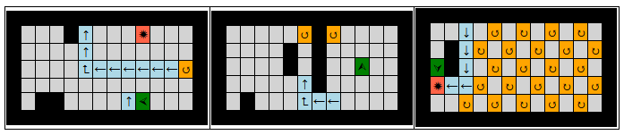
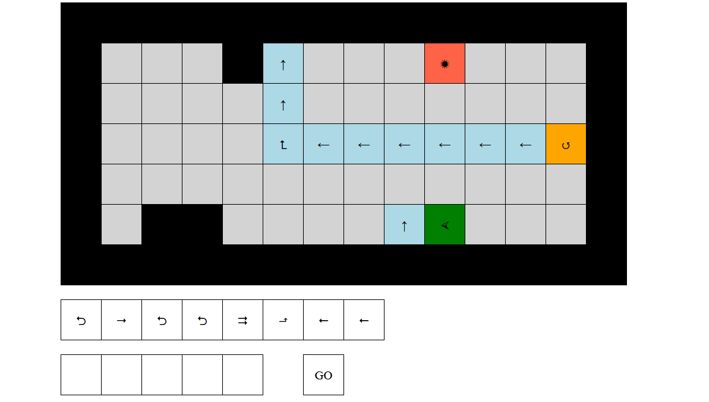

## Császkáló robot

A feladatod egy alkalmazás késztése, melyben a játékos célja, hogy eljuttassa a robotot a tábla bal alsó sarkába.

Minden pálya téglalap alakú. A játékos a kezdőképernyőn kiválaszthatja, hogy melyik pályán szeretne játszani. A pályát karaktertömbök tömbjeként adjuk meg, és a következő elemekből állhat:
- Padló (`▩`): nincs benne semmi különleges, nem történik semmi, ha a játékos rálép. Nincs színe.
- Fal (`◼`): ha a játékos beleütközik a robottal, veszített. Fekete színű.
- Daráló (`✹`): ha a játékos rálép, veszített. Piros színű.
- Fordító (`↺`,`↻`): ha a játékos rálép, a robotot balra/jobbra fordítja. Narancssárga színű.
- Futószalag (`←`, `↑`, `→`, `↓`): ha rálép a játékos, a robotot odébb tolja. Kék színű.
- Fordító futószalag (`⮥`, `⮡`, `⮦`, `⮢`, `⮤`, `⮣`, `⮧`, `⮠`): ha rálép a játékos, a robotot odébbtolja és el is fordítja. Kék színű.

A játékos a következőképp léphet:
- Adott egy parancskészlet, amiből a játék véletlenszerűen parancsokat ajánl fel (például 8 darabot). Ebből a játékos ötöt választ ki kattintással, amik a kiválasztás sorrendjében fognak lefutni. 
- Ha a játékos kiválasztott öt parancsot, elérhetővé válik egy gomb, mely elindítja a parancsfutást. Ekkor a parancsok egyesével lefutnak, és minden parancs lefutása után, de még a következő parancs lefutása előtt a futószalagokat ki kell értékelni.
- Az elérhető parancsok:
    - Előre egyet/kettőt/hármat (`⭢`/`⮆`/`⇶`): a robot abba az irányba mozog, amerre néz.
    - Hátra egyet (`⭠`): a robot hátrafele mozog egy mezőt.
    - Fordul jobbra/balra (`⬏`/`⬎`): a robot nézési iránya változik.
    - Megfordul (`⮌`): a robot iránya megfordul, vagyis innentől az ellenkező irányba néz.
- Miután az öt lépés (és az azokhoz tartozó futószalagok), lefutottak, feltöltődnek a felhasznált parancsok helyei, és újabb öt utasítás választható ki.

A játék akkor ér véget, ha a robot az öt parancs (és futószalagok) lefutása után, de még új parancsok hozzáadása előtt a pálya bal alsó sarkában áll. Fontos, hogy minden pályának a legszélső mezői falak, tehát a bal alsó sarok ennek figyelembevételével keresendő!

Amennyiben a játékos bármely kér parancs közt falra vagy darálóra érkezik (akár futószalagok által is), veszített. Ha a robot falba ütközne a lépéseivel, a játék szintén véget ér.

Ha a játék véget ért (akár győzelemmel, akár vereséggel), ezt jelezzük a játékosnak, és lehessen újra pályát választani. Amennyiben egy játék fut, nem lehet újat kezdeni, amíg a játékos nem nyer/veszít.

Pályaválasztás:  

Játéktér:  

### Megjegyzések tanárok számára

A fejlesztést javasolt részekre bontani:

- Állapot leírása
- Állapot megjelenítése (megjelenítő függvények + CSS)
- Események és állapotátmenetek
- További funkciók hozzáadása apróbb lépésekben