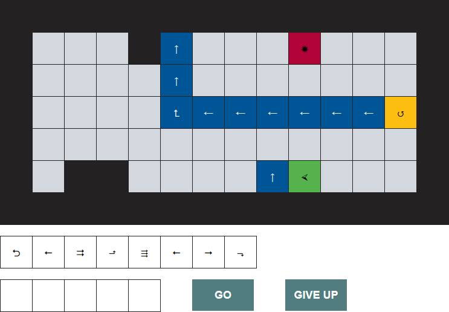

## Császkáló robot

A feladatod egy alkalmazás késztése, melyben a játékos célja, hogy eljuttassa a robotot a tábla bal alsó sarkába.

A játékos a kezdőképernyőn kiválaszthatja, hogy melyik pályán szeretne játszani. Minden pálya téglalap alakú, és négyzetes mezőkből épül fel. A pályát karaktertömbök tömbjeként adjuk meg, és a következő mezőkből állhat:
- Padló (`▩`): nincs benne semmi különleges, nem történik semmi, ha a játékos rálép. Szürke színű.
- Fal (`◼`): ha a játékos beleütközik a robottal, veszített. Fekete színű.
- Daráló (`✹`): ha a játékos rálép, veszített. Piros színű.
- Fordító (`↺`,`↻`): ha a játékos rálép, a robotot balra/jobbra fordítja 90 fokkal. Narancssárga színű.
- Futószalag (`←`, `↑`, `→`, `↓`): ha a játékos rálép, a robotot odébb tolja. Kék színű.
- Fordító futószalag (`⮥`, `⮡`, `⮦`, `⮢`, `⮤`, `⮣`, `⮧`, `⮠`): ha a játékos rálép, a robotot odébb tolja, és el is fordítja 90 fokkal. Kék színű.
- Robot kiinduló helye (`⮘`, `⮙`, `⮚`, `⮛`): a robot a játék kezdetén ezen a mezőn áll, és egy adott irányba néz. Zöld színű.

A játékos a következőképp léphet:
- Adott egy véges parancskészlet, amiből a játék véletlenszerűen parancsokat ajánl fel (például 8 darabot). Ezekből a játékos ötöt választ ki kattintással, amik a kiválasztás sorrendjében fognak lefutni. 
- Ha a játékos kiválasztott öt parancsot, elérhetővé válik egy gomb, mely elindítja a parancsfutást. Ekkor a parancsok egyesével lefutnak, és minden parancs lefutása után, de még a következő parancs előtt, a futószalagokat "ki kell értékelni".
- Az elérhető parancsok:
    - Előre egyet/kettőt/hármat (`⭢`/`⮆`/`⇶`): a robot abba az irányba mozog, amerre néz.
    - Hátra egyet (`⭠`): a robot hátrafele mozog egy mezőt.
    - Fordul jobbra/balra (`⬏`/`⬎`): a robot nézési iránya változik 90 fokkal.
    - Megfordul (`⮌`): a robot iránya megfordul, vagyis innentől az ellenkező irányba néz - tehát 180 fokot fordul.
- Az egyes parancsokból több példány is lehet az eredeti parancskészletben, így előfordulhat, hogy ugyanazon parancsból ugyanabban a körben többet is fel tud használni a játékos.
- Miután az öt lépés (és az azokhoz tartozó futószalagok), lefutottak, feltöltődnek a felhasznált parancsok helyei, és újabb öt utasítás választható ki.

A játékos akkor nyer, ha a robot az öt parancs (és futószalagok) lefutása után, de még új parancsok hozzáadása előtt a robot a pálya bal alsó sarkában áll. Fontos, hogy minden pályának a legszélső mezői falak, tehát a bal alsó sarok ennek figyelembevételével keresendő!

Amennyiben a játékos bármely két parancs közt falra vagy darálóra érkezik (akár futószalagok által is), veszített. Ha a robot falba ütközne a lépései közben, a játék szintén véget ér. Figyelni kell arra, hogy a többet előre lépő parancsok nem ugorhatnak át se falat, se darálót. Ha nem maradna öt parancs, amit a játékos felhasználhat, a játék szintén véget ér.

Ha a játék véget ért (akár győzelemmel, akár vereséggel), jelezzük azt a játékosnak, és lehessen újra pályát választani. Amennyiben egy játék fut, nem lehet újat kezdeni, amíg a játékos nem nyer/veszít, vagy fel nem adja.

Az egyik pálya lehetséges megjelenítése:  

### Megjegyzések tanárok számára

A fejlesztést javasolt részekre bontani:

- Állapot leírása
- Állapot megjelenítése (megjelenítő függvények + CSS)
- Események és állapotátmenetek
- További funkciók hozzáadása apróbb lépésekben